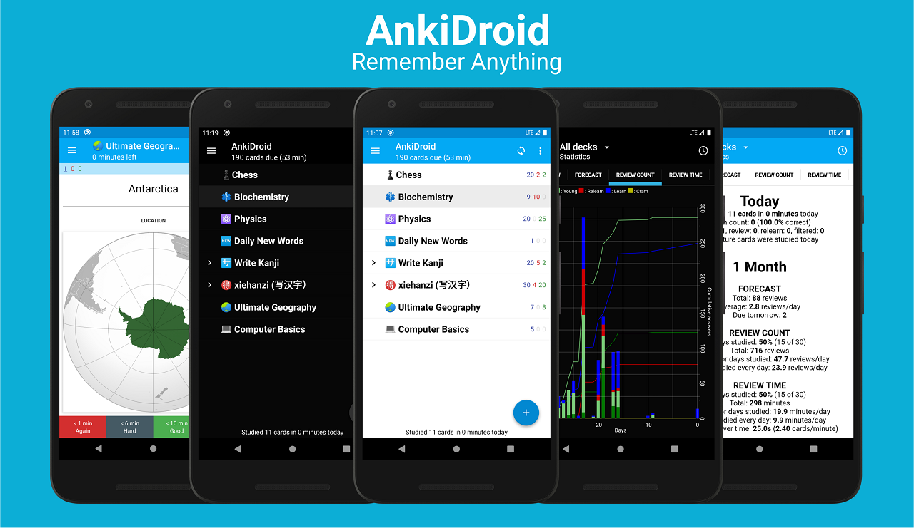

# Onramp Android Take Home Project 

## Overview 🤖

Congratulations for making it this far in the interview process for the SiriusXM + Pandora QE Apprenticeship at Onramp! This project seeks to better inform the Onramp team of your experience with testing Android apps. This is also designed to prepare you for your interview at SiriusXM + Pandora.

You will have seven days to complete this project. We expect those who have a moderate level of Android development experience to spend between 30 and 40 hours to implement, document, and submit the project to us. Depending on your level, it may take more or less time, so please plan accordingly.

**The project is due on Friday, March 5 at 9:00am PT/ 12:00pm ET**

#### Project Summary:
*   Total time available to complete: 7 days
*   Due date/time: Friday, March 5 at 9:00am PT/ 12:00pm ET
*   Expected development time to complete: 30 - 40 hours 
*   Required stack/tools: a computer with Android Studio

## Description and Details 🔎 

#### Android App Requirements
For this project, we want you to create UI tests using Espresso for [AnkiDroid](https://github.com/ankidroid/Anki-Android), a spaced repetition flaschard app.

<a href="https://crowdin.com/project/ankidroid"></img></a>

<a href="https://discord.gg/qjzcRTx"></img></a>

# [AnkiDroid](https://github.com/ankidroid/Anki-Android)

You will need to provide **full test coverage for at least eight features of the app.** A feature could be "creating a new flashcard", "displaying the front and back of a flashcard", or "changing the flashcard font style".

We recommend that you identify the features you're most interested in testing, not what you think your interviewers or Onramp would like to see.

**Scope your testing to what you can reasonably accomplish by the due date. Your test coverage (as a whole, not per feature) must meet the following requirements:**

*   Use of at least four different [ViewMatchers](https://developer.android.com/reference/androidx/test/espresso/matcher/ViewMatchers)
*   Use of at least three different [ViewActions](https://developer.android.com/reference/androidx/test/espresso/action/ViewActions)
*   Use of at least two different [ViewAssertions](https://developer.android.com/reference/androidx/test/espresso/assertion/ViewAssertions)
*   Test coverage for at least five different [Views](https://developer.android.com/reference/android/view/View)

**Note: you will need to detail how your tests meet these requirements in your repository's README file when you submit your project.**

#### A Note on Researching and Plagiarism

You are actively encouraged to research the web, books, videos, or tutorials for this project. That said, we expect all code that is submitted to be your own (e.g. this project should **NOT** be completed with another person). That means that we expect each candidate to refrain from copying and/or pasting code into the project. If we find copied code in your project, we will have to disqualify you. We’ve included some suggested web and video resources at the end of this document.

## What we're looking for 🌟

We will evaluate your project by assessing the overall strength and quality of the following 6 factors: 

#### Test Structure

The structure of an [Espresso](https://developer.android.com/training/testing/espresso) test involves finding a View, performing an action on that View, and validating the result. Following this structure will ensure that your tests are logical and easy-to-read. 

#### Test Variety

The Espresso testing framework allows you to find the UI component you want to test using [ViewMatchers](https://developer.android.com/reference/androidx/test/espresso/matcher/ViewMatchers), simulate a specific user interaction to perform on that UI component using [ViewActions](https://developer.android.com/reference/androidx/test/espresso/action/ViewActions), and verify that the UI reflects the expected behavior using [ViewAssertions](https://developer.android.com/reference/androidx/test/espresso/assertion/ViewAssertions). To make that process easier, Espresso provides a variety of methods that you can use.

**It is required that you leverage these methods by using at least four different ViewMatchers, three different ViewActions, and two different ViewAssertions in your project.** 
 

#### Test Coverage

[Buttons](https://developer.android.com/guide/topics/ui/controls/button), [TextViews](https://developer.android.com/reference/android/widget/TextView), [EditTexts](https://developer.android.com/reference/android/widget/EditText), and [Spinners](https://developer.android.com/guide/topics/ui/controls/spinner) are just a few commonly used Views within Android apps. Since these are the UI elements that users interact with, it’s important to test a variety of them across different features to ensure that they work properly. **For this reason, it’s mandatory that you test at least eight app features and at least five different Views in your project.**  

#### Testing Best Practices

It's important to subscribe to a set of best practices when writing tests for an Android app. Be mindful of these widely accepted principles:

* Tests should be complete and cover any applicable corner cases
* Tests should be maintainable and provide a solid foundation for future development
* Test names should be clear
* Tests should be [organized in directories based on execution environment](https://developer.android.com/training/testing/fundamentals)

#### Test Description

As detailed above, each project submission must include a README file, which provides an overview of each test class you created. This task assesses the critical competency of communicating and documenting technical concepts.

#### Version Control

We expect you to attempt to use version control best practices in your project. We will evaluate this by looking at the frequency of commits, commit messages, and diffs. We don’t expect you to be a pro with git, but we do expect you to be able to commit frequently rather than committing everything all at once.

## Submission Information 🚀

#### Submission Format

This repository will be your starting point. Please download (not clone or fork) this Github repository ([onramp-QE-android-project-take-home](https://github.com/onramp-io/onramp-QE-android-project-take-home)) and upload changes to a newly created repository. Once the testing has been completed, you'll be submitting a link to the new repository you created. Prior to submitting your project, you should update the README file to provide the following information about each test class you created:

* How you utilized testing technologies within that class
* Your decisions and thought process around 'why' you thought writing this test was important
* All of the corner cases you handled
* Where you got stuck and how you handled it
* The different ViewMatchers, ViewActions, and ViewAssertions you used
* The different Views you tested and why

Feel free to provide [screenshots](https://developer.android.com/studio/debug/am-screenshot) of any Activity Views that you test.

#### Submission Deadline + Process

You must submit your project by **9:00am PT/12:00pm ET, on March 5, 2021 using [this form](https://docs.google.com/forms/d/e/1FAIpQLSeyphOplL7AJdED7pT-vt5yeQfqpTbyrzXHIrLHViWaZ9yd4Q/viewform).** Be sure that your project is viewable by the Onramp team in a **public** repository (you can make it private after March 19, 2021).

Once you’ve submitted your project, you are expected to stop working on it. Any commits that occur after submission or the deadline will not be reviewed. 

## Additional Resources 📚

*   [Android Studio](https://developer.android.com/studio)
*   [Espresso for noobs pt 1](https://medium.com/@dnkilic/espresso-for-noobs-part-1-bbf1f586d651)
*   [Espresso recipes for Android](https://medium.com/@dnkilic/espresso-recipes-for-android-afb2466b8137)
*   [Espresso Cheat sheet](https://android.github.io/android-test/downloads/espresso-cheat-sheet-2.1.0.pdf)
*   [Fundamentals of Testing on Android](https://developer.android.com/training/testing/fundamentals)

## AnkiDroid information

<a href="https://crowdin.com/project/ankidroid"></img></a>

<a href="https://discord.gg/qjzcRTx"></img></a>

# [AnkiDroid](https://github.com/ankidroid/Anki-Android)
A semi-official port of the open source [Anki](http://ankisrs.net/index.html) spaced repetition flashcard system to Android. Memorize anything with AnkiDroid!

Wiki
----
View [Wiki](https://github.com/ankidroid/Anki-Android/wiki)

Help
----
Check the [user manual](https://ankidroid.org/docs/manual.html) and the wiki for usage instructions. See the [help page](https://ankidroid.org/docs/help.html) 
for how to submit a bug report or contact a project member, etc.

License
-------
[GPL-3.0 License](https://github.com/ankidroid/Anki-Android/blob/master/COPYING)
[AGPL-3.0 Licence](https://github.com/ankitects/anki/blob/master/LICENSE) for some part of the back-end
